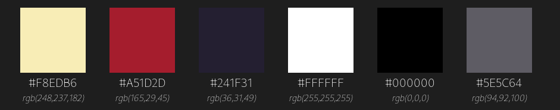

# Bad to Bone | Design Rules & Style Guide
Please find a set of design rules for the Bad to the Bone
endless runner game.

The first version of the game is to be for web browsers, using OPENGL.

The game screen must be small enough to fit in a browser window, and resolute enough to scale for larger screens.

Most monitors are sold with **1920x1080** resolution.

##### The chosen resolution for this title will be:

**`1280 x 720`**

*All assets will also be created and fitted to this resolution.*

##### For art production, sprites and backgrounds:

**`Krita`** [http://krita.org/en/](http://krita.org/en/)

#####  Color Palette:

